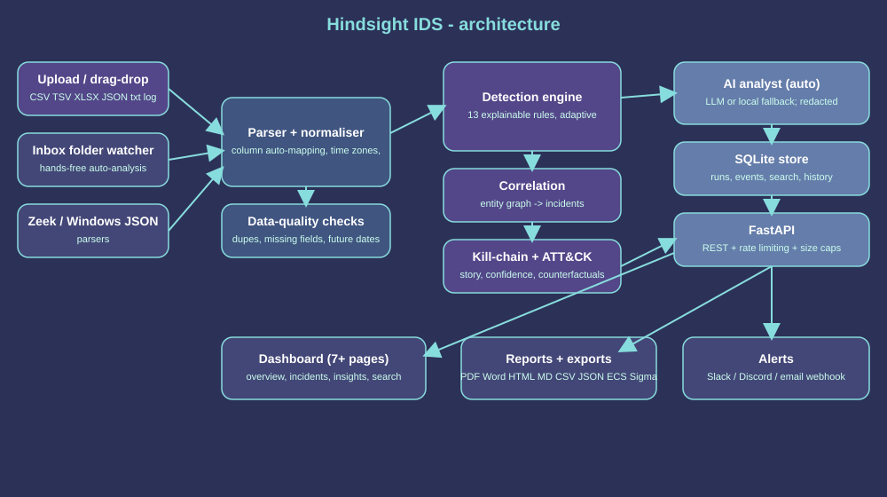

# Hindsight IDS

Log-based intrusion detection that does not just raise alerts: it groups related events into **incidents**, reconstructs the **attack story** across kill-chain stages (mapped to MITRE ATT&CK), shows the **raw log lines as evidence**, explains in **plain English** what happened and what to do, and lists the **look-alikes it deliberately cleared**. Built for ALGOTHON'26 problem **ALG-CYBER-01 (Find the Intruder)**.

**Live demo:** https://github.com/kashish17890/Hindsight-IDS.git  (free tier: the first load may take about a minute to wake up; click **Try the demo dataset**)
**Author:** Kashish Verma (solo participant)



## What it does
- **Ingest anything:** CSV/TSV (any column names - auto-mapped, or mapped by you in a dialog), XLSX, JSON/JSONL, SSH syslog, Apache/nginx, Zeek TSV, Windows Event JSON. Time-zone selector, duplicate and missing-field warnings.
- **Detect:** 13 explainable rules (brute force, password spray, **low-and-slow** guessing, **distributed** attacks on one account, success-after-failures, impossible travel, privilege escalation, lateral movement, exfiltration, web scanning, injection payloads, log tampering, off-hours login). Count/size thresholds **adapt** to the dataset (median + k x MAD, never below a safe floor) and are shown on the Insights page.
- **Correlate and explain:** entity-graph incidents, kill-chain strip, confidence with reasons, counterfactual notes, ATT&CK Navigator export, Sigma export.
- **Automate with AI:** every analysis is triaged automatically by an AI analyst (any OpenAI-compatible model or local Ollama; built-in rule-based fallback when none is configured). Hosted models only see redacted aggregates (addresses and accounts replaced by placeholders). Files dropped into the `inbox/` folder are analysed hands-free.
- **Remember:** results, run history and every event are stored in SQLite and survive restarts. Search events by account, IP, time range, text or warning type.
- **Report:** PDF, Word, HTML, Markdown, CSV, JSON, ECS, redacted exports; Slack/Discord/email notification.
- **Dashboard:** upload, overview, incidents (story / timeline / evidence), insights, accounts and addresses, cleared alarms, event search, reports, floating AI chat. Animated, with a plain-English layer for non-technical readers and a one-click Indigo/Graphite theme switch (bottom of the sidebar).

## Run locally
```bash
python -m venv .venv
# Windows PowerShell: .venv\Scripts\Activate.ps1      macOS/Linux: source .venv/bin/activate
pip install -r requirements.txt
uvicorn app.main:app --reload
```
Open http://localhost:8000 and choose **Try the demo dataset**, or upload your own file. Run the tests with `pytest -q` (31 tests).

## Deploy a public demo
`render.yaml`, `Procfile` and the `Dockerfile` are included. On Render: New > Blueprint > pick this repo; it builds the Docker image and exposes `/`. The demo button works with no configuration. Storage on free tiers is ephemeral (history resets on redeploy). Do not put a paid LLM key on a public deployment unless you are happy for visitors to use it; `/api/chat`, `/api/webhook` and `/api/sigma/import` are rate-limited (20 per minute per client, `HINDSIGHT_RATE_PER_MIN`), and uploads are capped at 50 MB / 500,000 events (`HINDSIGHT_MAX_MB`).

## AI analyst
### Set up free local AI chat on Windows

1. Install Ollama for Windows from [ollama.com/download](https://ollama.com/download) and open Ollama.
2. In VS Code's terminal, download a model once: `ollama pull llama3.2`. This requires internet and several GB of free disk space.
3. In the project folder, copy `.env.example` to `.env`. Its Ollama address and model are already filled in; you do not need an API key.
4. Start or restart Hindsight from the project folder with `python -m uvicorn app.main:app --reload`.
5. Open the chat panel. It should say **Ollama local configured**. Ask a new question. The first answer may take a little longer while the model loads.

If Ollama reports that the model is missing, run `ollama pull llama3.2` in a terminal. Ollama exposes an OpenAI-compatible chat endpoint locally, which Hindsight uses; your key is not sent anywhere for this local setup. For a hosted provider instead, change `.env` to the commented OpenAI-compatible settings and enter that provider's API key. A hosted API key is separate from a ChatGPT subscription.

The app reads `.env` on startup and never sends the key to the browser. Keep `.env` private; it is excluded from the project ZIP and Git. The configured provider receives the user's chat messages and aggregate analysis context, but not raw uploaded event rows. General questions can be sent even before uploading a log; analysis-specific answers need an analysis run.

## Automation
- `HINDSIGHT_AUTO_TRIAGE=0` turns off automatic LLM triage (the rule-based fallback still runs).
- Drop log files into `inbox/` (created automatically; `HINDSIGHT_INBOX` to change). They are analysed, triaged and stored; processed files move to `inbox/done`, unreadable ones to `inbox/failed`. Disable with `HINDSIGHT_WATCH=0`.

## CLI
```bash
python -m app.cli logs/sample_logs.csv --format json --redact-pii -o analysis.json
python -m app.cli logs/sample_logs.csv --format ecs -o events-ecs.json
python -m app.cli logs/sample_logs.csv --format navigator -o navigator-layer.json
```

## Optional integrations

Set `HINDSIGHT_WEBHOOK_KIND=slack` or `discord` with `HINDSIGHT_WEBHOOK_URL` for incoming webhook delivery. For email, set `HINDSIGHT_WEBHOOK_KIND=email`, `HINDSIGHT_SMTP_HOST`, `HINDSIGHT_EMAIL_FROM`, and `HINDSIGHT_EMAIL_TO`; optional settings include `HINDSIGHT_SMTP_PORT`, `HINDSIGHT_SMTP_USER`, and `HINDSIGHT_SMTP_PASSWORD`. Email uses STARTTLS. Keep URLs and credentials private; only configure a receiver you control.

Optional exact-match local enrichment accepts `HINDSIGHT_GEOIP_MAP_JSON='{"203.0.113.7":"Exampleland"}'` and `HINDSIGHT_THREAT_FEED_JSON='[{"ip":"203.0.113.7","label":"internal-test-indicator"}]'`. Use maintained, authorized data. These do not provide external GeoIP or threat-reputation lookups.

## Key endpoints
| Endpoint | Purpose |
|---|---|
| `GET /api/demo`, `POST /api/analyze` | Analyse demo or an uploaded file (`tz` and `mapping` form fields optional; 422 asks for a column mapping) |
| `GET /api/search` | Search stored events (`user`, `ip`, `rule`, `q`, `start`, `end`) |
| `GET /api/runs`, `GET /api/compare/{a}/{b}` | Run history and comparison (persisted) |
| `GET /api/report/{id}?fmt=pdf|docx|html|md|csv|json` | Reports (id 0 = all incidents) |
| `POST /api/chat` | Ask the AI analyst about aggregate findings |
| `GET /api/export/navigator`, `GET /api/sigma`, `GET /api/export/ecs` | ATT&CK layer, Sigma rules, ECS JSON |

## Validation, honestly
See [docs/VALIDATION.md](docs/VALIDATION.md). Short version: on a real public SSH log (no labels) the parser worked and the burst rules fired on the obvious brute-forcers; **no precision/recall is claimed for real data**. The synthetic demo scores 1.0/1.0 but was written alongside the detector, so that proves the pipeline, not real-world accuracy. The test suite (31 tests) covers low-and-slow and distributed attacks, clock skew and mixed time zones, duplicates, huge/malformed/binary files, all-benign logs, missing fields, unfamiliar schemas, search, persistence, AI redaction and rate limiting.

## Known limitations
Rule thresholds are heuristics (adaptive, but not learned). No external GeoIP or threat-intel lookup unless you supply local mappings. Native EVTX is not parsed (use Event Viewer JSON export). Syslog lines carry no year, so the current year is assumed. Timestamps without a time zone are read as UTC unless you pick a zone. Exact duplicate lines are removed only when 30% or more of the file is duplicated (otherwise kept as possibly genuine). The live LLM path was tested with a mocked provider, not against a real hosted model. SQLite is single-node. Legacy `.xls` must be saved as `.xlsx`.

## Disclosure
- **AI-assisted development:** this project was built with AI assistance (Claude). All code was run and tested by the author.
- **Runtime AI (optional):** if you configure it, an OpenAI-compatible provider or local Ollama receives user chat messages and redacted aggregate findings, never raw log rows. With nothing configured, no external requests are made.
- **Data:** `app/generator.py` creates the synthetic demo data (no external source). `docs/OpenSSH_2k.log` is a public sample from LogHub 2.0 (logpai/loghub-2.0), used only for validation.
- **Libraries:** FastAPI, Uvicorn, python-multipart, openpyxl, ReportLab, python-docx, pytest, httpx. MITRE ATT&CK technique IDs are referenced by ID only.
- **Logo:** the supplied Hindsight image.

## Future improvements
- Evaluate on a labelled intrusion dataset (e.g. CICIDS2017 or LANL) and report precision/recall honestly.
- Optional learned anomaly scores alongside the explainable rules.
- Optional GeoIP and threat-intelligence lookups with maintained data sources.
- Native EVTX parsing and Postgres storage for multi-user deployments.

## Architecture notes
Rules run over normalised events, produce alerts, which are correlated through shared accounts and external addresses into incidents. Decision: explainable rules over a black-box model so every alert comes with evidence; SQLite so the single-binary demo needs no external services; the AI layer is advisory and never executes actions.
